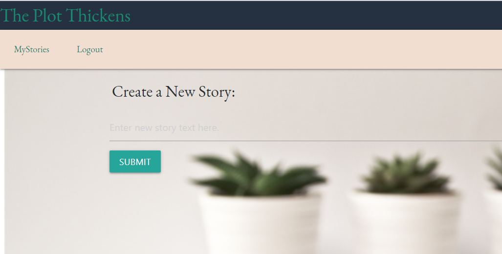

# The Plot Thickens

# Table of Contents:
  
- [The Plot Thickens](#the-plot-thickens)
- [Table of Contents:](#table-of-contents)
  - [Description:](#description)
  - [Installation Instructions:](#installation-instructions)
  - [Usage Information:](#usage-information)
  - [License:](#license)
 

## Description: 

This is an application for creative writers who want to keep track of notes about story ideas.   The application was made using Javascript, GraphQL, MongoDB, JWT, and React.

## Installation Instructions:

This application can be cloned at https://github.com/AnnMarkham/the-plot-thickens

## Usage Information:

View the depoloyed applicatoin at:  https://am-the-plot-thickens.herokuapp.com/. 

Here is a preview of the home screen:     To create a new story:      Users can view all stories that they have created:     

## License:

This site is under this license: MIT

For details on this license, please follow: https://opensource.org/licenses/MIT

